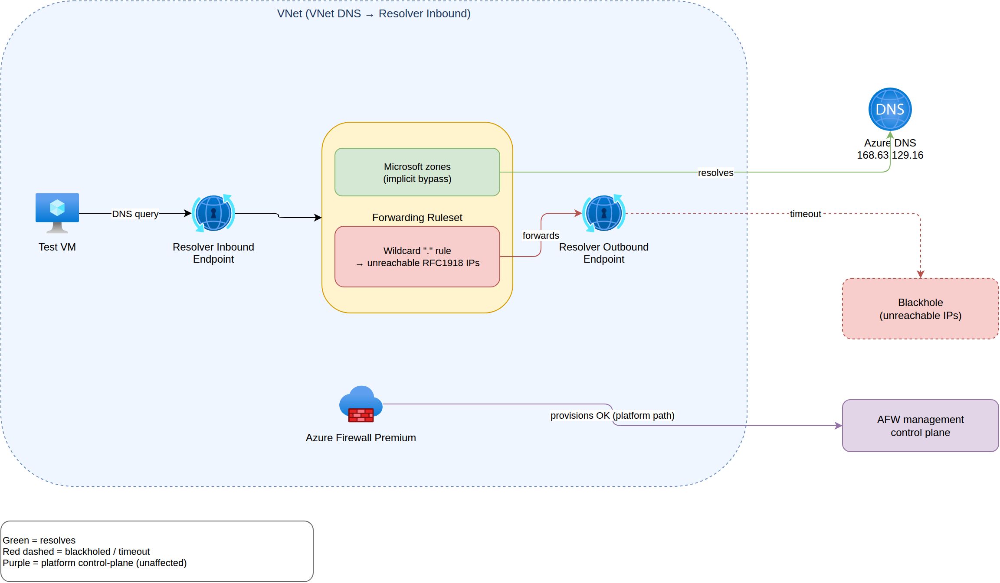

# Azure DNS Private Resolver — wildcard blackhole + Azure Firewall Premium

Small lab: what happens when you point a VNet at an **Azure DNS Private Resolver** whose
**outbound wildcard (`.`) rule** forwards *everything* to DNS servers that don't exist, and
then try to deploy **Azure Firewall Premium** into the same VNet?

Short answer:

1. The blackhole works for workload VMs — public names like `example.com` fail to resolve.
2. **Microsoft-owned domains (`microsoft.com`, `login.microsoftonline.com`, …) still resolve.**
   Azure DNS Private Resolver does not permit forwarding rules for a reserved set of
   Microsoft-owned domains — queries for those names always use Azure's default
   resolution regardless of the ruleset. See
   [*Restrictions* in the Private Resolver overview](https://learn.microsoft.com/en-us/azure/dns/private-resolver-overview#restrictions).
3. **Azure Firewall Premium deployed successfully** despite the wildcard blackhole.
   The control-plane provisioning path does not appear to depend on the data-plane DNS
   path that the wildcard rule breaks.

Tested in Sweden Central, April 2026.

## Architecture



Source: [`docs/architecture.drawio`](docs/architecture.drawio) (open with
[draw.io](https://app.diagrams.net/) to edit).

## Topology

| Component | Purpose |
|---|---|
| VNet `10.x.0.0/16` | Workload + resolver + firewall |
| Subnet `dns-inbound` | Private Resolver inbound endpoint |
| Subnet `dns-outbound` | Private Resolver outbound endpoint |
| Subnet `vms` | Test Linux VM |
| Subnet `AzureFirewallSubnet` | Firewall |
| DNS Forwarding Ruleset | One rule: domain `.` → unreachable IPs (`10.255.255.253:53`, `10.255.255.254:53`) |
| VNet DNS servers | Resolver inbound endpoint IP (forces all VNet DNS through the ruleset) |

## What was tested

### 1. VM DNS resolution (from inside the VNet)

Ran via `az vm run-command` against a standard Ubuntu test VM:

```json
{
  "example.com":               { "ok": false, "error": "gaierror(-2, 'Name or service not known')" },
  "microsoft.com":             { "ok": true,  "ips": ["13.107.226.53", "13.107.253.53"] },
  "login.microsoftonline.com": { "ok": true,  "ips": ["20.190.147.0", "…"] }
}
```

→ Wildcard blackhole is doing its job for public DNS.
→ Microsoft bypass works transparently — **no explicit allow-rule was needed**.

### 2. Azure Firewall Premium deploy with blackhole rule active

Deployed `afw` (Premium SKU) + its Public IP + ip-config while the wildcard rule was still
in place:

| Step | Result |
|---|---|
| `az network firewall create` | Succeeded |
| `az network firewall ip-config create` | Succeeded |
| Activity log (`Creates or updates an Azure Firewall`) | Succeeded |
| `ipConfigurations[].provisioningState` | Succeeded |
| Firewall resource `provisioningState` (at capture time) | Updating (normal; converges to Succeeded) |

The original hypothesis — that Firewall provisioning would *fail* because its management
plane couldn't resolve public names through a broken VNet DNS — **was not confirmed**.
Firewall creates and provisions cleanly under these conditions.

The follow-up step ("delete wildcard, redeploy firewall, confirm works") therefore didn't
need to be triggered.

## Why the Microsoft bypass exists

Azure DNS Private Resolver does not allow forwarding rules for a set of Microsoft-owned
domains — queries for those names always use Azure's default resolution regardless of any
ruleset (including a wildcard `.` rule).

Documented under *Restrictions* in the Private Resolver overview:

> *"Some domain names are reserved for Microsoft use and DNS forwarding rule sets for
> these domains aren't allowed."*

— [Azure DNS Private Resolver overview — Restrictions](https://learn.microsoft.com/en-us/azure/dns/private-resolver-overview#restrictions)

The currently-reserved list is published in the same doc. That list is why
`microsoft.com` and `login.microsoftonline.com` continue to resolve in this lab while
`example.com` does not.

## Notes

- Run in Sweden Central; should behave identically in any region that supports DNS
  Private Resolver + Azure Firewall Premium.
- VNet DNS change propagates ~60s; the VM test sleeps briefly after linking before
  running resolution checks.
- Azure Firewall Premium create + provisioning typically takes 15–30 minutes.
